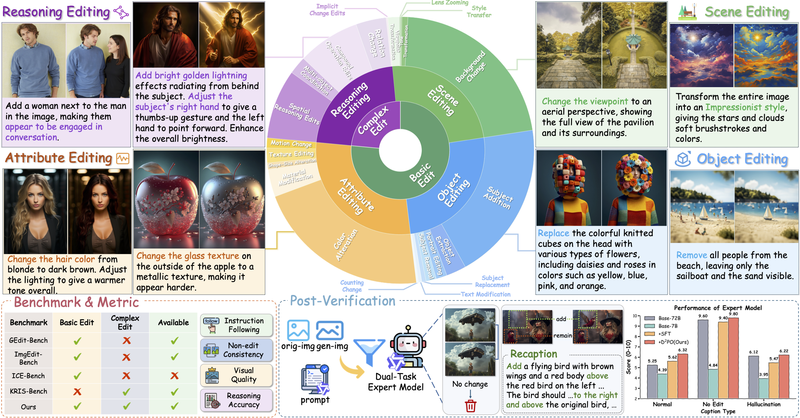
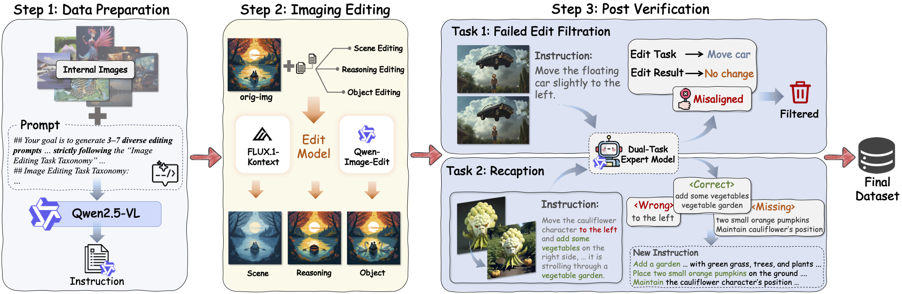
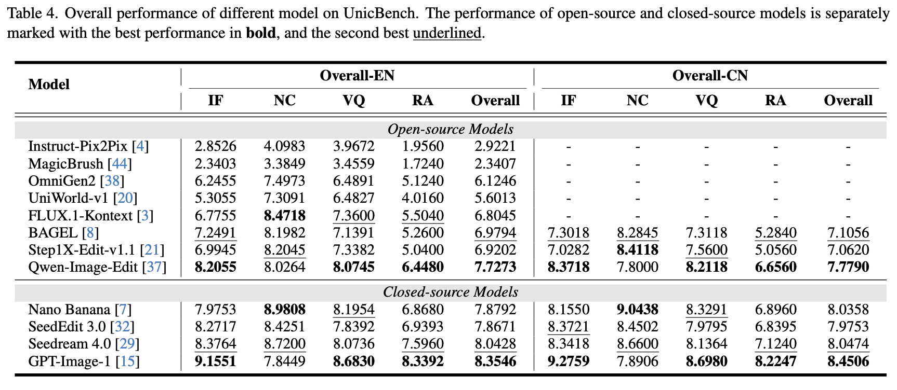

# UnicEdit-10M: A Dataset and Benchmark Breaking the Scale-Quality Barrier via Unified Verification for Reasoning-Enriched Edits
## 📌 Abstract

With the rapid advances of powerful multimodal models such as GPT-4o, Nano Banana, and Seedream 4.0 in Image Editing, the performance gap between closed-source and open-source models is widening, primarily due to the scarcity of large-scale, high-quality training data and comprehensive benchmarks capable of diagnosing model weaknesses across diverse editing behaviors. Existing data construction methods face a scale-quality trade-off: human annotations are high-quality but not scalable, while automated pipelines suffer from error propagation and noise. To address this, we introduce a lightweight data pipeline that replaces multi-toolchains with an end-to-end model and a unified post-verification stage. For scalable quality control, we train a 7B dual-task expert model, **Qwen-Verify**, for efficient failure detection and instruction recaptioning. This pipeline yields **UnicEdit-10M**, a 10M-scale dataset spanning diverse basic and complex editing tasks. We also propose **UnicBench**, a general benchmark that extends beyond basic edits to explicitly assess spatial and knowledge-driven reasoning. To enable fine-grained diagnosis, we introduce novel metrics, including *Non-edit Consistency* and *Reasoning Accuracy*. Our analysis of mainstream models on UnicBench reveals their limitations and provides clear directions for future research. The dataset, benchmark, and code will be released.
<p align="center">
  
</p>

## 🔥 News

- **[2025.xx]** Code and benchmark released.
- **[2025.xx]** Paper released on arXiv.

## ✅ TODO

- [x] Release UnicBench evaluation code
- [x] Release benchmark test data
- [ ] Release UnicEdit-10M dataset
- [ ] Release Qwen-Verify model
- [ ] Release data generation pipeline

## 🎯 Highlights

- **UnicEdit-10M**: A quality-aware data curation pipeline with unified post-verification and a 10M-scale high-quality image editing dataset with diverse basic and complex editing tasks.
- **Qwen-Verify**: A 7B dual-task expert model for efficient failure detection and instruction recaptioning.
- **UnicBench**: A comprehensive benchmark with novel metrics (Non-edit Consistency, Reasoning Accuracy) for fine-grained diagnosis.

## 📊 Data Pipeline

<p align="center">
  
</p>

## 🖼️ Dataset Showcases

<p align="center">
  
</p>

## 📁 Project Structure

```
UnicBench/
├── assets/                 # Images for README
├── data/
│   ├── prompts.py          # VLM evaluation prompts (IF, NC, VQ, RA)
│   └── test_data.jsonl     # Benchmark test data
├── eval/
│   ├── eval_pipeline.py    # Main evaluation pipeline
│   └── calculate_scores.py # Score statistics tool
├── inference/
│   ├── gen_samples_flux.py # Generate samples using FLUX
│   └── gen_samples_flux.sh # Shell script for inference
└── models/                 # VLM models for evaluation
```

## 🛠️ Installation

```bash
# Create conda environment
conda create -n unicbench python=3.11
conda activate unicbench

# Install dependencies
pip install -r requirements.txt
```

## 📐 UnicBench

### Benchmark Overview

UnicBench consists of **1,100 samples** across **4 task categories** and **22 subtasks**:

| Task Category | Subtasks | Samples |
|---------------|----------|---------|
| Object Editing | 7 subtasks | 350 |
| Attribute Editing | 5 subtasks | 250 |
| Scene Editing | 5 subtasks | 250 |
| Reasoning Editing | 5 subtasks | 250 |

### Evaluation Metrics

| Metric | Description |
|--------|-------------|
| **IF** (Instruction Following) | Measures how well the edit follows the given instruction |
| **NC** (Non-edit Consistency) | Measures consistency of non-edited regions |
| **VQ** (Visual Quality) | Measures visual quality and naturalness of edited images |
| **RA** (Reasoning Accuracy) | Measures reasoning accuracy (only for Reasoning Editing tasks) |

## 🚀 Usage

### 1. Generate Edited Images

First, generate edited images using your image editing model. The output should be saved following this path format:
```
{save_dir}/{model_name}/{subtask_name}/{language}/{key}.png
```

We provide reference inference scripts for `FLUX.1-Kontext` and `Qwen-Image-Edit`:
```bash
bash inference/gen_samples_flux.sh  # for FLUX.1-Kontext
bash inference/gen_samples_qwen.sh  # for Qwen-Image-Edit
```

The output directory structure must follow the format below:

```
{save_dir}/
└── {model_name}/
    ├── {subtask_name}/{language}/      # Edited images
    └── eval_output/{vlm_name}/
        ├── {subtask_name}_{language}_results.jsonl  # Per-sample results
        └── statistics/
            └── {language}_statistics.json           # Aggregated statistics
```


### 2. Run Evaluation

Use `eval_pipeline.py` to evaluate edited images and compute final scores:

```bash
cd eval

python eval_pipeline.py \
    --data_path ../data/test_data.jsonl \
    --image_dir /path/to/benchmark/images \
    --save_dir /path/to/results \
    --edit_model_name your_model_name \
    --vlm_model_name gpt-4.1 \
    --languages en \
    --num_workers 8

python eval_pipeline.py \
    --data_path ../data/test_data.jsonl \
    --image_dir /mnt/shenzhen2cephfs/mm-base-vision/kotisye/data/oteam_edit_500w/benchmark/UnicBench \
    --save_dir /mnt/shenzhen2cephfs/mm-base-vision/kotisye/result/unicbench \
    --edit_model_name qwen-image-edit \
    --vlm_model_name gpt-4.1 \
    --languages en \
    --num_workers 8
```

**Parameters:**
| Parameter | Description |
|-----------|-------------|
| `--data_path` | Path to test data jsonl file |
| `--image_dir` | Directory containing original benchmark images |
| `--save_dir` | Root directory to save results |
| `--edit_model_name` | Name of your editing model |
| `--vlm_model_name` | VLM model for evaluation (default: `gpt-4.1-2025-04-1`) |
| `--languages` | Languages to evaluate: `en`, `cn`, or both |
| `--num_workers` | Number of parallel workers (for API-based VLMs) |
| `--skip_evaluation` | Skip evaluation, only compute statistics |

### 3. Calculate Statistics (Optional)

If evaluation has already been completed and you only need to aggregate statistics, use `calculate_scores.py` to compute score statistics from evaluation results:

```bash
python calculate_scores.py \
    --save_dir /path/to/results \
    --edit_model_name your_model_name \
    --vlm_model_name gpt-4.1 \
    --languages en cn
```

## 📈 Benchmark Results

Evaluation results of mainstream image editing models on UnicBench:
<p align="center">
  
</p>

## 📜 Citation

```bibtex
@article{unicedit2025,
  title={UnicEdit-10M: A Dataset and Benchmark Breaking the Scale-Quality Barrier via Unified Verification for Reasoning-Enriched Edits},
  author={},
  journal={arXiv preprint},
  year={2025}
}
```

## 📄 License

This project is released under the [Apache 2.0 License](./LICENSE.txt).

## 🙏 Acknowledgements

We thank all contributors and the open-source community for their support.