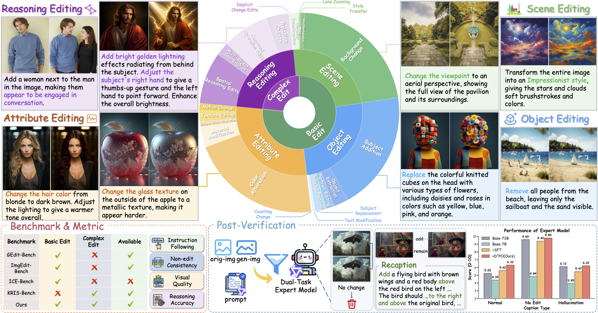
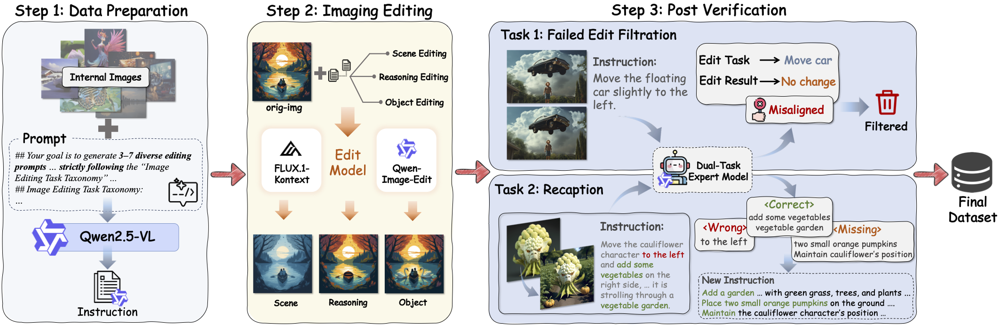
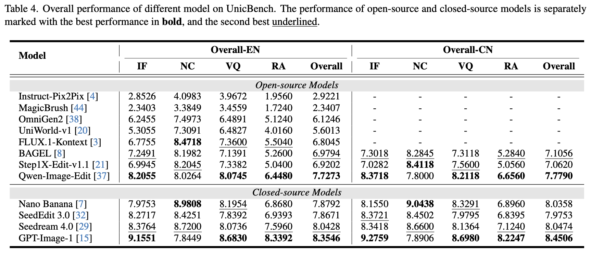

# UnicEdit-10M: A Dataset and Benchmark Breaking the Scale-Quality Barrier via Unified Verification for Reasoning-Enriched Edits

<p align="center">
  <a href="https://huggingface.co/datasets/xiaotanhua/UnicEdit-10M">
    
  </a>
  <a href="https://huggingface.co/datasets/xiaotanhua/UnicBench">
    
  </a>
  <a href="http://arxiv.org/abs/2512.02790">
    
  </a>
  <a href="https://hongsexiaotanhua.github.io/UnicEdit-10M/">
    
  </a>
</p>


## 📌 Abstract

With the rapid advances of powerful multimodal models such as GPT-4o, Nano Banana, and Seedream 4.0 in Image Editing, the performance gap between closed-source and open-source models is widening, primarily due to the scarcity of large-scale, high-quality training data and comprehensive benchmarks capable of diagnosing model weaknesses across diverse editing behaviors. Existing data construction methods face a scale-quality trade-off: human annotations are high-quality but not scalable, while automated pipelines suffer from error propagation and noise. To address this, we introduce a lightweight data pipeline that replaces multi-toolchains with an end-to-end model and a unified post-verification stage. For scalable quality control, we train a 7B dual-task expert model, **Qwen-Verify**, for efficient failure detection and instruction recaptioning. This pipeline yields **UnicEdit-10M**, a 10M-scale dataset spanning diverse basic and complex editing tasks. We also propose **UnicBench**, a general benchmark that extends beyond basic edits to explicitly assess spatial and knowledge-driven reasoning. To enable fine-grained diagnosis, we introduce novel metrics, including *Non-edit Consistency* and *Reasoning Accuracy*. Our analysis of mainstream models on UnicBench reveals their limitations and provides clear directions for future research. The dataset, benchmark, and code will be released.
<p align="center">
  
</p>

## 🔥 News
- **[2026.2.8]** We integrated the evaluation of **LongCat-Image-Edit** into the full benchmark comparison table.
- **[2026.2.5]** UnicEdit-10M released.
- **[2025.12.2]** Code and benchmark released.
- **[2025.12.2]** Paper released on arXiv.

## ✅ TODO

- [x] Release UnicBench evaluation code
- [x] Release benchmark test data
- [x] Release UnicEdit-10M dataset
- [ ] Release Qwen-Verify model
- [ ] Release data generation pipeline

## 🎯 Highlights

- **UnicEdit-10M**: A quality-aware data curation pipeline with unified post-verification and a 10M-scale high-quality image editing dataset with diverse basic and complex editing tasks.
- **Qwen-Verify**: A 7B dual-task expert model for efficient failure detection and instruction recaptioning.
- **UnicBench**: A comprehensive benchmark with novel metrics (Non-edit Consistency, Reasoning Accuracy) for fine-grained diagnosis.

## 📊 Data Pipeline

<p align="center">
  
</p>

## 🖼️ Dataset Showcases

<p align="center">
  
</p>

## 📁 Project Structure

```
UnicBench/
├── assets/                 # Images for README
├── data/
│   ├── prompts.py          # VLM evaluation prompts (IF, NC, VQ, RA)
│   └── test_data.jsonl     # Benchmark test data
├── eval/
│   ├── eval_pipeline.py    # Main evaluation pipeline
│   └── calculate_scores.py # Score statistics tool
├── inference/
│   ├── gen_samples_flux.py # Generate samples using FLUX
│   └── gen_samples_flux.sh # Shell script for inference
└── models/                 # VLM models for evaluation
```

## 🛠️ Installation

```bash
# Create conda environment
conda create -n unicbench python=3.11
conda activate unicbench

# Install dependencies
pip install -r requirements.txt
```

## 📥 Dataset

### UnicEdit-10M Dataset

You can load the UnicEdit-10M dataset directly from Hugging Face using the `datasets` library:

```python
from datasets import load_dataset

# Load the full dataset
dataset = load_dataset("xiaotanhua/UnicEdit-10M")

# Streaming mode (recommended for large datasets)
dataset = load_dataset("xiaotanhua/UnicEdit-10M", streaming=True)

# Access samples
for sample in dataset['train']:
    print(sample['key'])
    print(sample['prompt_en'])
    # sample['src_image'] and sample['edit_image'] are PIL Image objects
    break
```

### UnicBench Benchmark

You can load the UnicBench benchmark directly from Hugging Face using the `datasets` library:

```python
from datasets import load_dataset

# Load the dataset
ds = load_dataset("xiaotanhua/UnicBench")

# Access data
print(ds['train'][0])
```

## 📐 UnicBench

### Benchmark Overview

UnicBench consists of **1,100 samples** across **4 task categories** and **22 subtasks**:

| Task Category | Subtasks | Samples |
|---------------|----------|---------|
| Object Editing | 7 subtasks | 350 |
| Attribute Editing | 5 subtasks | 250 |
| Scene Editing | 5 subtasks | 250 |
| Reasoning Editing | 5 subtasks | 250 |

### Evaluation Metrics

| Metric | Description |
|--------|-------------|
| **IF** (Instruction Following) | Measures how well the edit follows the given instruction |
| **NC** (Non-edit Consistency) | Measures consistency of non-edited regions |
| **VQ** (Visual Quality) | Measures visual quality and naturalness of edited images |
| **RA** (Reasoning Accuracy) | Measures reasoning accuracy (only for Reasoning Editing tasks) |

## 🚀 Usage

### 1. Generate Edited Images

First, generate edited images using your image editing model. The output should be saved following this path format:
```
{save_dir}/{model_name}/{subtask_name}/{language}/{key}.png
```

We provide reference inference scripts for `FLUX.1-Kontext` and `Qwen-Image-Edit`:
```bash
bash inference/gen_samples_flux.sh  # for FLUX.1-Kontext
bash inference/gen_samples_qwen.sh  # for Qwen-Image-Edit
```

The output directory structure must follow the format below:

```
{save_dir}/
└── {model_name}/
    ├── {subtask_name}/{language}/      # Edited images
    └── eval_output/{vlm_name}/
        ├── {subtask_name}_{language}_results.jsonl  # Per-sample results
        └── statistics/
            └── {language}_statistics.json           # Aggregated statistics
```


### 2. Run Evaluation

Use `eval_pipeline.py` to evaluate edited images and compute final scores. You can load data from a local JSONL file or directly from Hugging Face.

**Option 1: Using Hugging Face Dataset (Recommended)**
```bash
cd eval

python eval_pipeline.py \
    --data_path xiaotanhua/UnicBench \
    --save_dir /path/to/results \
    --edit_model_name your_model_name \
    --vlm_model_name gpt-4.1 \
    --languages en \
    --num_workers 8
```

**Option 2: Using Local JSONL File**
```bash
cd eval

python eval_pipeline.py \
    --data_path ../data/test_data.jsonl \
    --image_dir /path/to/benchmark/images \
    --save_dir /path/to/results \
    --edit_model_name your_model_name \
    --vlm_model_name gpt-4.1 \
    --languages en \
    --num_workers 8
```

**Parameters:**
| Parameter | Description |
|-----------|-------------|
| `--data_path` | Path to test data jsonl file OR Hugging Face dataset name (e.g., `xiaotanhua/UnicBench`) |
| `--image_dir` | Directory containing original benchmark images (Required for JSONL, Optional for HF dataset) |
| `--save_dir` | Root directory to save results |
| `--edit_model_name` | Name of your editing model |
| `--vlm_model_name` | VLM model for evaluation (default: `gpt-4.1-2025-04-14`) |
| `--languages` | Languages to evaluate: `en`, `cn`, or both |
| `--num_workers` | Number of parallel workers (for API-based VLMs) |
| `--skip_evaluation` | Skip evaluation, only compute statistics |

### 3. Calculate Statistics (Optional)

If evaluation has already been completed and you only need to aggregate statistics, use `calculate_scores.py` to compute score statistics from evaluation results:

```bash
python calculate_scores.py \
    --save_dir /path/to/results \
    --edit_model_name your_model_name \
    --vlm_model_name gpt-4.1 \
    --languages en cn
```

## 📈 Benchmark Results

Evaluation results of mainstream image editing models on UnicBench:
<!-- <p align="center">
  
</p> -->
<div style="overflow-x: auto; margin-bottom: 16px;">
  <table style="border-collapse: collapse; width: 100%; font-size: 14px;">
    <thead>
      <tr>
        <th style="white-space: nowrap; padding: 8px; border: 1px solid #d0d7de; background-color: #f6f8fa;" rowspan="2">Model</th>
        <th style="padding: 8px; border: 1px solid #d0d7de; background-color: #f6f8fa;" colspan="5">Overall-EN</th>
        <th style="padding: 8px; border: 1px solid #d0d7de; background-color: #f6f8fa;" colspan="5">Overall-CN</th>
      </tr>
      <tr>
        <th style="white-space: nowrap; padding: 8px; border: 1px solid #d0d7de; background-color: #f6f8fa;">IF</th>
        <th style="white-space: nowrap; padding: 8px; border: 1px solid #d0d7de; background-color: #f6f8fa;">NC</th>
        <th style="white-space: nowrap; padding: 8px; border: 1px solid #d0d7de; background-color: #f6f8fa;">VQ</th>
        <th style="white-space: nowrap; padding: 8px; border: 1px solid #d0d7de; background-color: #f6f8fa;">RA</th>
        <th style="white-space: nowrap; padding: 8px; border: 1px solid #d0d7de; background-color: #f6f8fa;">Overall</th>
        <th style="white-space: nowrap; padding: 8px; border: 1px solid #d0d7de; background-color: #f6f8fa;">IF</th>
        <th style="white-space: nowrap; padding: 8px; border: 1px solid #d0d7de; background-color: #f6f8fa;">NC</th>
        <th style="white-space: nowrap; padding: 8px; border: 1px solid #d0d7de; background-color: #f6f8fa;">VQ</th>
        <th style="white-space: nowrap; padding: 8px; border: 1px solid #d0d7de; background-color: #f6f8fa;">RA</th>
        <th style="white-space: nowrap; padding: 8px; border: 1px solid #d0d7de; background-color: #f6f8fa;">Overall</th>
      </tr>
    </thead>
    <tbody>
      <tr>
        <td style="padding: 8px; border: 1px solid #d0d7de; background-color: #eaecef; font-style: italic; text-align: center;" colspan="11">Open-Source Models</td>
      </tr>
      <tr>
        <td style="white-space: nowrap; padding: 8px; border: 1px solid #d0d7de;">Instruct-Pix2Pix</td>
        <td style="padding: 8px; border: 1px solid #d0d7de;">2.8526</td>
        <td style="padding: 8px; border: 1px solid #d0d7de;">4.0983</td>
        <td style="padding: 8px; border: 1px solid #d0d7de;">3.9672</td>
        <td style="padding: 8px; border: 1px solid #d0d7de;">1.9560</td>
        <td style="padding: 8px; border: 1px solid #d0d7de;">2.9221</td>
        <td style="padding: 8px; border: 1px solid #d0d7de;">-</td>
        <td style="padding: 8px; border: 1px solid #d0d7de;">-</td>
        <td style="padding: 8px; border: 1px solid #d0d7de;">-</td>
        <td style="padding: 8px; border: 1px solid #d0d7de;">-</td>
        <td style="padding: 8px; border: 1px solid #d0d7de;">-</td>
      </tr>
      <tr>
        <td style="white-space: nowrap; padding: 8px; border: 1px solid #d0d7de;">MagicBrush</td>
        <td style="padding: 8px; border: 1px solid #d0d7de;">2.3403</td>
        <td style="padding: 8px; border: 1px solid #d0d7de;">3.3849</td>
        <td style="padding: 8px; border: 1px solid #d0d7de;">3.4559</td>
        <td style="padding: 8px; border: 1px solid #d0d7de;">1.7240</td>
        <td style="padding: 8px; border: 1px solid #d0d7de;">2.3407</td>
        <td style="padding: 8px; border: 1px solid #d0d7de;">-</td>
        <td style="padding: 8px; border: 1px solid #d0d7de;">-</td>
        <td style="padding: 8px; border: 1px solid #d0d7de;">-</td>
        <td style="padding: 8px; border: 1px solid #d0d7de;">-</td>
        <td style="padding: 8px; border: 1px solid #d0d7de;">-</td>
      </tr>
      <tr>
        <td style="white-space: nowrap; padding: 8px; border: 1px solid #d0d7de;">OmniGen2</td>
        <td style="padding: 8px; border: 1px solid #d0d7de;">6.2455</td>
        <td style="padding: 8px; border: 1px solid #d0d7de;">7.4973</td>
        <td style="padding: 8px; border: 1px solid #d0d7de;">6.4891</td>
        <td style="padding: 8px; border: 1px solid #d0d7de;">5.1240</td>
        <td style="padding: 8px; border: 1px solid #d0d7de;">6.1246</td>
        <td style="padding: 8px; border: 1px solid #d0d7de;">-</td>
        <td style="padding: 8px; border: 1px solid #d0d7de;">-</td>
        <td style="padding: 8px; border: 1px solid #d0d7de;">-</td>
        <td style="padding: 8px; border: 1px solid #d0d7de;">-</td>
        <td style="padding: 8px; border: 1px solid #d0d7de;">-</td>
      </tr>
      <tr>
        <td style="white-space: nowrap; padding: 8px; border: 1px solid #d0d7de;">UniWorld-v1</td>
        <td style="padding: 8px; border: 1px solid #d0d7de;">5.3055</td>
        <td style="padding: 8px; border: 1px solid #d0d7de;">7.3091</td>
        <td style="padding: 8px; border: 1px solid #d0d7de;">6.4827</td>
        <td style="padding: 8px; border: 1px solid #d0d7de;">4.0160</td>
        <td style="padding: 8px; border: 1px solid #d0d7de;">5.6013</td>
        <td style="padding: 8px; border: 1px solid #d0d7de;">-</td>
        <td style="padding: 8px; border: 1px solid #d0d7de;">-</td>
        <td style="padding: 8px; border: 1px solid #d0d7de;">-</td>
        <td style="padding: 8px; border: 1px solid #d0d7de;">-</td>
        <td style="padding: 8px; border: 1px solid #d0d7de;">-</td>
      </tr>
      <tr>
        <td style="white-space: nowrap; padding: 8px; border: 1px solid #d0d7de;">FLUX.1-Kontext</td>
        <td style="padding: 8px; border: 1px solid #d0d7de;">6.7755</td>
        <td style="padding: 8px; border: 1px solid #d0d7de;"><u>8.4718</u></td>
        <td style="padding: 8px; border: 1px solid #d0d7de;">7.3600</td>
        <td style="padding: 8px; border: 1px solid #d0d7de;">5.5040</td>
        <td style="padding: 8px; border: 1px solid #d0d7de;">6.8045</td>
        <td style="padding: 8px; border: 1px solid #d0d7de;">-</td>
        <td style="padding: 8px; border: 1px solid #d0d7de;">-</td>
        <td style="padding: 8px; border: 1px solid #d0d7de;">-</td>
        <td style="padding: 8px; border: 1px solid #d0d7de;">-</td>
        <td style="padding: 8px; border: 1px solid #d0d7de;">-</td>
      </tr>
      <tr>
        <td style="white-space: nowrap; padding: 8px; border: 1px solid #d0d7de;">BAGEL</td>
        <td style="padding: 8px; border: 1px solid #d0d7de;">7.2491</td>
        <td style="padding: 8px; border: 1px solid #d0d7de;">8.1982</td>
        <td style="padding: 8px; border: 1px solid #d0d7de;">7.1391</td>
        <td style="padding: 8px; border: 1px solid #d0d7de;">5.2600</td>
        <td style="padding: 8px; border: 1px solid #d0d7de;">6.9794</td>
        <td style="padding: 8px; border: 1px solid #d0d7de;">7.3018</td>
        <td style="padding: 8px; border: 1px solid #d0d7de;">8.2845</td>
        <td style="padding: 8px; border: 1px solid #d0d7de;">7.3118</td>
        <td style="padding: 8px; border: 1px solid #d0d7de;">5.2840</td>
        <td style="padding: 8px; border: 1px solid #d0d7de;">7.1056</td>
      </tr>
      <tr>
        <td style="white-space: nowrap; padding: 8px; border: 1px solid #d0d7de;">Step1X-Edit-v1.1</td>
        <td style="padding: 8px; border: 1px solid #d0d7de;">6.9945</td>
        <td style="padding: 8px; border: 1px solid #d0d7de;">8.2045</td>
        <td style="padding: 8px; border: 1px solid #d0d7de;">7.3382</td>
        <td style="padding: 8px; border: 1px solid #d0d7de;">5.0400</td>
        <td style="padding: 8px; border: 1px solid #d0d7de;">6.9202</td>
        <td style="padding: 8px; border: 1px solid #d0d7de;">7.0282</td>
        <td style="padding: 8px; border: 1px solid #d0d7de;"><u>8.4118</u></td>
        <td style="padding: 8px; border: 1px solid #d0d7de;">7.5600</td>
        <td style="padding: 8px; border: 1px solid #d0d7de;">5.0560</td>
        <td style="padding: 8px; border: 1px solid #d0d7de;">7.0620</td>
      </tr>
      <tr>
        <td style="white-space: nowrap; padding: 8px; border: 1px solid #d0d7de;">Qwen-Image-Edit</td>
        <td style="padding: 8px; border: 1px solid #d0d7de;"><u>8.2055</u></td>
        <td style="padding: 8px; border: 1px solid #d0d7de;">8.0264</td>
        <td style="padding: 8px; border: 1px solid #d0d7de;"><u>8.0745</u></td>
        <td style="padding: 8px; border: 1px solid #d0d7de;"><u>6.4480</u></td>
        <td style="padding: 8px; border: 1px solid #d0d7de;"><u>7.7273</u></td>
        <td style="padding: 8px; border: 1px solid #d0d7de;"><u>8.3718</u></td>
        <td style="padding: 8px; border: 1px solid #d0d7de;">7.8000</td>
        <td style="padding: 8px; border: 1px solid #d0d7de;"><u>8.2118</u></td>
        <td style="padding: 8px; border: 1px solid #d0d7de;"><u>6.6560</u></td>
        <td style="padding: 8px; border: 1px solid #d0d7de;"><u>7.7790</u></td>
      </tr>
      <tr>
        <td style="white-space: nowrap; padding: 8px; border: 1px solid #d0d7de;">LongCat-Image-Edit</td>
        <td style="padding: 8px; border: 1px solid #d0d7de;"><b>8.6058</b></td>
        <td style="padding: 8px; border: 1px solid #d0d7de;"><b>8.8321</b></td>
        <td style="padding: 8px; border: 1px solid #d0d7de;"><b>8.2774</b></td>
        <td style="padding: 8px; border: 1px solid #d0d7de;"><b>7.3482</b></td>
        <td style="padding: 8px; border: 1px solid #d0d7de;"><b>8.2344</b></td>
        <td style="padding: 8px; border: 1px solid #d0d7de;"><b>8.6427</b></td>
        <td style="padding: 8px; border: 1px solid #d0d7de;"><b>8.9109</b></td>
        <td style="padding: 8px; border: 1px solid #d0d7de;"><b>8.3500</b></td>
        <td style="padding: 8px; border: 1px solid #d0d7de;"><b>7.3800</b></td>
        <td style="padding: 8px; border: 1px solid #d0d7de;"><b>8.2993</b></td>
      </tr>
      <tr>
        <td style="padding: 8px; border: 1px solid #d0d7de; background-color: #eaecef; font-style: italic; text-align: center;" colspan="11">Closed-source Models</td>
      </tr>
      <tr>
        <td style="white-space: nowrap; padding: 8px; border: 1px solid #d0d7de;">Nano Banana</td>
        <td style="padding: 8px; border: 1px solid #d0d7de;">7.9753</td>
        <td style="padding: 8px; border: 1px solid #d0d7de;"><b>8.9808</b></td>
        <td style="padding: 8px; border: 1px solid #d0d7de;"><u>8.1954</u></td>
        <td style="padding: 8px; border: 1px solid #d0d7de;">6.8680</td>
        <td style="padding: 8px; border: 1px solid #d0d7de;">7.8792</td>
        <td style="padding: 8px; border: 1px solid #d0d7de;">8.1550</td>
        <td style="padding: 8px; border: 1px solid #d0d7de;"><b>9.0438</b></td>
        <td style="padding: 8px; border: 1px solid #d0d7de;"><u>8.3291</u></td>
        <td style="padding: 8px; border: 1px solid #d0d7de;">6.8960</td>
        <td style="padding: 8px; border: 1px solid #d0d7de;">8.0358</td>
      </tr>
      <tr>
        <td style="white-space: nowrap; padding: 8px; border: 1px solid #d0d7de;">Seedit 3.0</td>
        <td style="padding: 8px; border: 1px solid #d0d7de;">8.2717</td>
        <td style="padding: 8px; border: 1px solid #d0d7de;">8.4251</td>
        <td style="padding: 8px; border: 1px solid #d0d7de;">7.8392</td>
        <td style="padding: 8px; border: 1px solid #d0d7de;">6.9393</td>
        <td style="padding: 8px; border: 1px solid #d0d7de;">7.8671</td>
        <td style="padding: 8px; border: 1px solid #d0d7de;"><u>8.3721</u></td>
        <td style="padding: 8px; border: 1px solid #d0d7de;">8.4502</td>
        <td style="padding: 8px; border: 1px solid #d0d7de;">7.9795</td>
        <td style="padding: 8px; border: 1px solid #d0d7de;">6.8395</td>
        <td style="padding: 8px; border: 1px solid #d0d7de;">7.9753</td>
      </tr>
      <tr>
        <td style="white-space: nowrap; padding: 8px; border: 1px solid #d0d7de;">Seedream 4.0</td>
        <td style="padding: 8px; border: 1px solid #d0d7de;"><u>8.3764</u></td>
        <td style="padding: 8px; border: 1px solid #d0d7de;"><u>8.7200</u></td>
        <td style="padding: 8px; border: 1px solid #d0d7de;">8.0736</td>
        <td style="padding: 8px; border: 1px solid #d0d7de;"><u>7.5960</u></td>
        <td style="padding: 8px; border: 1px solid #d0d7de;"><u>8.0428</u></td>
        <td style="padding: 8px; border: 1px solid #d0d7de;">8.3418</td>
        <td style="padding: 8px; border: 1px solid #d0d7de;"><u>8.6600</u></td>
        <td style="padding: 8px; border: 1px solid #d0d7de;">8.1364</td>
        <td style="padding: 8px; border: 1px solid #d0d7de;"><u>7.1240</u></td>
        <td style="padding: 8px; border: 1px solid #d0d7de;"><u>8.0474</u></td>
      </tr>
      <tr>
        <td style="white-space: nowrap; padding: 8px; border: 1px solid #d0d7de;">GPT-Image-1</td>
        <td style="padding: 8px; border: 1px solid #d0d7de;"><b>9.1551</b></td>
        <td style="padding: 8px; border: 1px solid #d0d7de;">7.8449</td>
        <td style="padding: 8px; border: 1px solid #d0d7de;"><b>8.6830</b></td>
        <td style="padding: 8px; border: 1px solid #d0d7de;"><b>8.3392</b></td>
        <td style="padding: 8px; border: 1px solid #d0d7de;"><b>8.3546</b></td>
        <td style="padding: 8px; border: 1px solid #d0d7de;"><b>9.2759</b></td>
        <td style="padding: 8px; border: 1px solid #d0d7de;">7.8906</td>
        <td style="padding: 8px; border: 1px solid #d0d7de;"><b>8.6980</b></td>
        <td style="padding: 8px; border: 1px solid #d0d7de;"><b>8.2247</b></td>
        <td style="padding: 8px; border: 1px solid #d0d7de;"><b>8.4506</b></td>
      </tr>
    </tbody>
  </table>
</div>

## 📜 Citation

```bibtex
@article{ye2025unicedit,
  title={UnicEdit-10M: A Dataset and Benchmark Breaking the Scale-Quality Barrier via Unified Verification for Reasoning-Enriched Edits},
  author={Ye, Keming and Huang, Zhipeng and Fu, Canmiao and Liu, Qingyang and Cai, Jiani and Lv, Zheqi and Li, Chen and Lyu, Jing and Zhao, Zhou and Zhang, Shengyu},
  journal={arXiv preprint arXiv:2512.02790},
  year={2025}
}
```

## 📄 License

This project is released under the [Apache 2.0 License](./LICENSE).

## 🙏 Acknowledgements

We thank all contributors and the open-source community for their support.